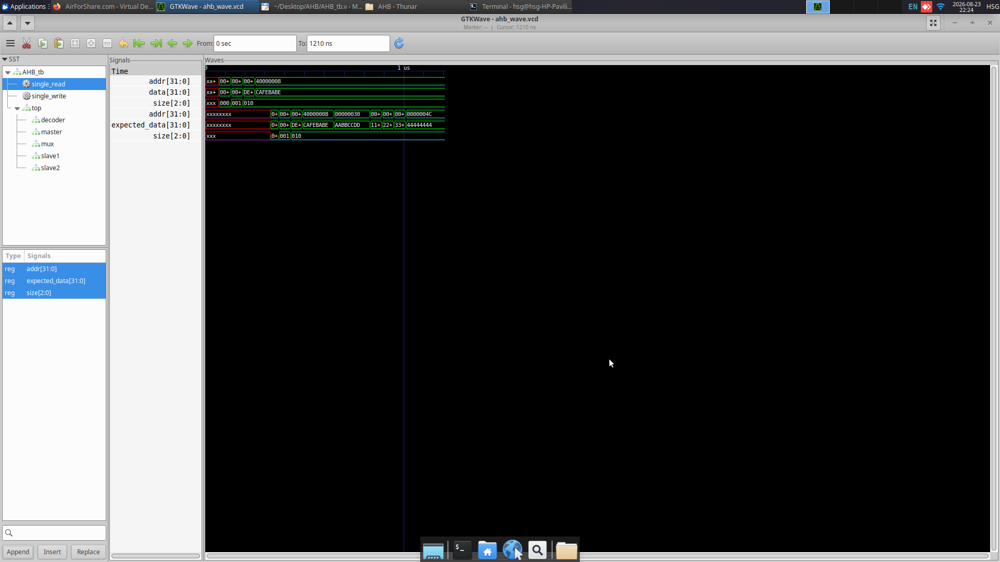
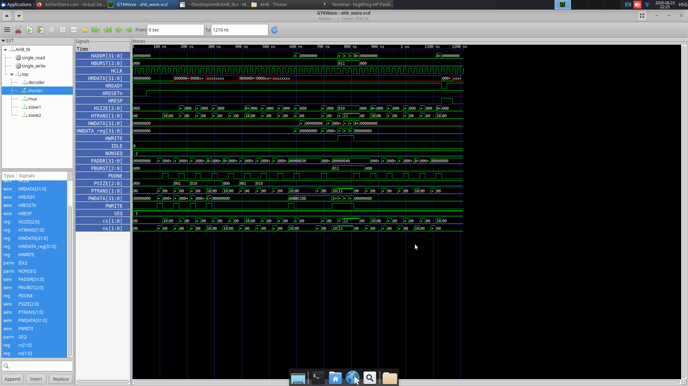
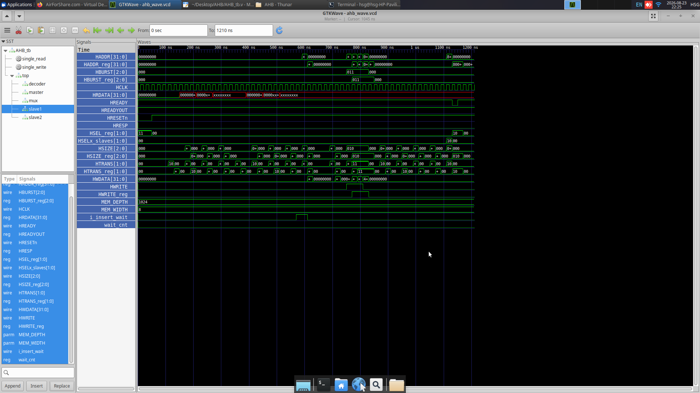
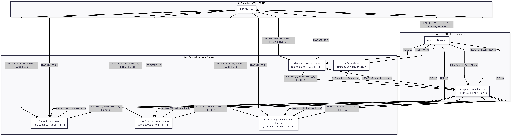

# AMBA AHB-Lite Master-Slave Bus Interface (Lab 2)

This repository contains the Verilog implementation, testbench verification, and architectural documentation for the **AMBA AHB-Lite (Single Master)** protocol system.

---

## Directory Structure

```text
AHB/
├── README.md
├── pics/
│   ├── TASK3.png
│   ├── task2.png
│   ├── task22.png
│   └── task222.png
└── src/
    ├── AHB_Decoder.v
    ├── AHB_Lite_Master.v
    ├── AHB_MUX.v
    ├── AHB_Slave_1.v
    ├── AHB_Slave_2.v
    ├── AHB_TOP.v
    └── AHB_tb.v
```

---

## Task 2: AHB-Lite Master-Slave Bug Analysis & Verification

### 1. Overview of Implemented Test Cases
The testbench (`src/AHB_tb.v`) verifies the design across 5 required test cases:
1. **Test Case 1: Single Write Transfer (No Wait-State)**: 8-bit, 16-bit, and 32-bit single writes to Slave 1 and Slave 2 with `PBURST = 3'b000` (SINGLE) and `PTRANS = 2'b10` (NONSEQ).
2. **Test Case 2: Single Read Transfer (No Wait-State)**: Read transfers from the same addresses, verifying data correctness with automated pass/fail reporting.
3. **Test Case 3: Write with Wait-State Insertion**: Slave 1 deasserts `HREADYOUT = 0`. The Master stalls its state machine and holds `HADDR`, `HWDATA`, and control lines stable until `HREADY` goes high.
4. **Test Case 4: Burst Transfer (INCR4 - 4 Transfers)**: 4-beat incrementing burst (`PBURST = 3'b011`, `PSIZE = 3'b010`) stepping addresses by +4 bytes across sequential beats (`NONSEQ` followed by 3 `SEQ` beats), followed by readback verification.
5. **Test Case 5: Invalid Address with Error Response**: Access to unmapped address `0x80000000` generates the standard AHB 2-cycle `ERROR` response (`HRESP = 1, HREADY = 0` in cycle 1, followed by `HRESP = 1, HREADY = 1` in cycle 2).

---

### 2. Debugging Analysis & Fixes Applied

- **Decoder & MUX Pipelining Hazard**: 
  - *Issue*: In the original code, the multiplexer select signal (`HSELx_Mux`) was driven combinationally from the address phase. When consecutive transfers targeted different slaves, the MUX switched prematurely before the previous slave could complete its data phase.
  - *Fix*: Made `HSELx_Mux` registered in `AHB_Decoder.v` so it tracks the slave currently in its data phase.

- **Master State Stalling on Wait States**: 
  - *Issue*: The master FSM and output registers changed state on every clock cycle regardless of `HREADY`, violating the protocol when slaves inserted wait states.
  - *Fix*: Gated all master transitions, address computations, and data phase updates with `if (HREADY)`.

- **Slave Selection Latching**: 
  - *Issue*: Slaves checked the instantaneous address-phase select line (`HSELx_slaves`) during the data phase. When the master moved to a different slave in the next cycle, the first slave aborted the ongoing write.
  - *Fix*: Added `HSEL_reg` in each slave to sample `HSELx_slaves` during the address phase and execute the write/read in the data phase.

- **INCR4 4-Beat Burst Support**: 
  - *Issue*: The master only handled `PBURST = 3'b001` (undefined INCR) and failed to handle `3'b011` (INCR4).
  - *Fix*: Extended the burst address increment logic to handle 4-beat bursts.

- **Unmapped Address Error Response**: 
  - *Issue*: Accessing invalid addresses caused `HREADY = 0` indefinitely, resulting in a permanent bus deadlock.
  - *Fix*: Implemented a 2-cycle default error response FSM in `AHB_MUX.v`.

- **Memory Indexing Bug**: 
  - *Issue*: `AHB_Slave_2.v` had an out-of-bounds index `memory_2[HADDR[29:0]]` and used un-registered addresses in the read phase.
  - *Fix*: Corrected the index to use registered `HADDR_reg[5:0]`.

---

### 3. Task 2 Simulation Screenshots

#### Test Case 1 & 2 Waveforms


#### Test Case 3 & 4 Waveforms


#### Test Case 5 & Testbench Console Output


---

## Task 3: Comprehensive AHB System Architecture (4 Slaves)

### 1. System Block Diagram


```text
+-----------------------------------------------------------------------------------------+
|                                    AHB SYSTEM (4 SLAVES)                                |
+-----------------------------------------------------------------------------------------+

                                 +-------------------------+
                                 |       AHB Master        |
                                 |       (CPU / DMA)       |
                                 +------------+------------+
                                              |
                     +------------------------+------------------------+
                     | HADDR[31:0], HWRITE, HSIZE, HTRANS, HBURST      | HWDATA[31:0]
                     v                                                 v
           +-------------------+                             +-------------------+
           |  Address Decoder  |                             | Write Data Bus    |
           +---------+---------+                             +---------+---------+
                     | HSEL_1..4, HSEL_NOMAP                           |
                     |                                                 |
      +--------------+-------------+-------------+-------------+       |
      |              |             |             |             |       |
      v              v             v             v             v       v
+-----------+  +-----------+ +-----------+ +-----------+ +-----------+ |
|  Slave 1  |  |  Slave 2  | |  Slave 3  | |  Slave 4  | |  Default  | |
|   SRAM    |  | Boot ROM  | | APB Bridge| |DMA Buffer | |   Slave   | |
+-----+-----+  +-----+-----+ +-----+-----+ +-----+-----+ +-----+-----+ |
      |              |             |             |             |       |
      | HRDATA_1     | HRDATA_2    | HRDATA_3    | HRDATA_4    | ERROR |
      | HREADYOUT_1  | HREADYOUT_2 | HREADYOUT_3 | HREADYOUT_4 | (2-cyc|
      | HRESP_1      | HRESP_2     | HRESP_3     | HRESP_4     | resp) |
      +--------------+-------------+-------------+-------------+       |
                                   |                                   |
                                   v                                   |
                     +---------------------------+                     |
                     |   Response Multiplexer    |<-- MUX Select ------+ (from Decoder)
                     +-------------+-------------+
                                   |
                                   +---> HRDATA[31:0] (to Master)
                                   +---> HRESP        (to Master)
                                   +---> HREADY       (Bus-Wide Feedback to Master & Slaves)
```

---

### 2. Architectural Description

1. **AHB Master (Manager)**:
   - Initiates transfers by driving address and control signals (`HADDR`, `HWRITE`, `HSIZE`, `HTRANS`, `HBURST`) in the Address Phase, and write data (`HWDATA`) in the Data Phase.
   - Monitors `HREADY` to insert wait states when a slave is busy, and handles `HRESP` for errors.

2. **Central Address Decoder**:
   - Decodes the upper bits of `HADDR` to assert a single select line (`HSEL_1`, `HSEL_2`, `HSEL_3`, `HSEL_4`, or `HSEL_NOMAP` for invalid spaces).
   - Generates registered MUX select signals to route the response during the Data Phase.

3. **4 Slaves & Address Mapping**:
   - **Slave 1 (Internal SRAM - `0x0000_0000` to `0x1FFF_FFFF`)**: High-bandwidth volatile memory for code execution and data storage.
   - **Slave 2 (Boot ROM - `0x2000_0000` to `0x3FFF_FFFF`)**: Non-volatile storage holding initial bootloader firmware.
   - **Slave 3 (AHB-to-APB Bridge - `0x4000_0000` to `0x5FFF_FFFF`)**: Bridges high-speed AHB traffic to low-speed APB peripherals (UART, I2C, SPI, Timers).
   - **Slave 4 (High-Speed DMA Buffer - `0x6000_0000` to `0x7FFF_FFFF`)**: High-throughput packet buffer for networking and display subsystems.
   - **Default Slave**: Catches accesses to unmapped address spaces and generates a compliant 2-cycle `ERROR` response.

4. **Response Multiplexer**:
   - Multiplexes `HRDATA`, `HREADYOUT`, and `HRESP` from the active slave back to the master based on the registered slave select signal.

5. **Global `HREADY` Feedback**:
   - The multiplexed `HREADY` is broadcast back to the Master and all Slaves to synchronize pipelined transfer completion across the bus.

---

## Task 4: High-Speed vs Low-Speed Peripherals in SoC Design

### 1. 5 High-Speed Peripherals (Connected via AHB / AXI)

| # | Peripheral | Description | Typical Data Rate | Bus Interface | Common Applications |
|---|---|---|---|---|---|
| **1** | **Direct Memory Access (DMA) Controller** | Hardware engine that transfers large data blocks between memory and peripherals without CPU intervention. | 1 GB/s – 10+ GB/s | **AHB / AXI Master & Slave** (Burst-capable) | Audio/video buffering, network packet transfers, memory copy operations. |
| **2** | **DDR Memory Controller (DDR4 / DDR5 / LPDDR5)** | High-performance controller managing command scheduling and timing for external dynamic RAM. | 25.6 GB/s – 51.2+ GB/s | **AXI / AHB Multi-Port Interface** | Main system memory interface in mobile processors, servers, and AI chips. |
| **3** | **PCIe (PCI Express) Controller** | High-speed serialized point-to-point expansion bus controller. | 1 GB/s per lane (Gen 3) to 4 GB/s per lane (Gen 5) | **AXI / AHB High-Performance Bus** | Interfacing NVMe SSDs, external graphics cards, and high-speed NICs. |
| **4** | **Gigabit / 10G Ethernet MAC** | Network interface controller handling Ethernet frame framing, CRC check, and FIFO buffering. | 1 Gbps – 10 Gbps (125 MB/s – 1.25 GB/s) | **AHB / AXI with Scatter-Gather DMA** | Network routers, industrial automation controllers, and IoT gateways. |
| **5** | **MIPI CSI-2 / DSI Controller (Camera / Display)** | High-speed serial protocol controller for camera sensors and display panels. | 1 Gbps – 4.5 Gbps per lane | **AHB / AXI with internal FIFO/DMA** | Smartphone cameras, automotive vision systems, 4K display panels. |

---

### 2. 5 Low-Speed Peripherals (Connected via APB)

| # | Peripheral | Description | Typical Data Rate | Bus Interface | Common Applications |
|---|---|---|---|---|---|
| **1** | **UART (Universal Asynchronous Receiver-Transmitter)** | Asynchronous serial bus for sequential character and command transmission. | 9.6 kbps – 921.6 kbps (up to ~3 Mbps) | **APB (Advanced Peripheral Bus)** | Debug consoles, GPS modules, Bluetooth communication. |
| **2** | **I2C (Inter-Integrated Circuit) Controller** | Two-wire serial bus for interconnecting low-speed on-board components. | 100 kbps (Std), 400 kbps (Fast), 3.4 Mbps (High Speed) | **APB** | Reading temperature sensors, real-time clocks (RTC), EEPROMs, touchscreens. |
| **3** | **SPI (Serial Peripheral Interface) Controller** | Synchronous 4-wire serial protocol providing full-duplex communication. | 1 Mbps – 50 Mbps | **APB** | Interfacing SPI NOR Flash, SD cards, and small LCD displays. |
| **4** | **General Purpose Timer / Watchdog (WDT)** | Hardware counters generating periodic tick interrupts or issuing system resets upon CPU hang. | < 1 Mbps (Register I/O) | **APB** | OS tick generation, PWM generation, safety heartbeat monitoring. |
| **5** | **GPIO (General Purpose Input/Output) Controller** | Programmable I/O pins for digital input sensing and output control. | DC – 10 MHz (Register I/O) | **APB** | LED driving, push-button sensing, chip enables, interrupt lines. |

---

## How to Simulate

### Using Icarus Verilog & GTKWave:
1. Navigate to the project root directory:
   ```powershell
   cd c:\Users\HSG\Desktop\AHB
   ```
2. Compile the design:
   ```powershell
   iverilog -o ahb_sim.vvp src/AHB_Decoder.v src/AHB_MUX.v src/AHB_Lite_Master.v src/AHB_Slave_1.v src/AHB_Slave_2.v src/AHB_TOP.v src/AHB_tb.v
   ```
3. Run simulation:
   ```powershell
   vvp ahb_sim.vvp
   ```
4. View waveforms in GTKWave:
   ```powershell
   gtkwave ahb_wave.vcd
   ```
