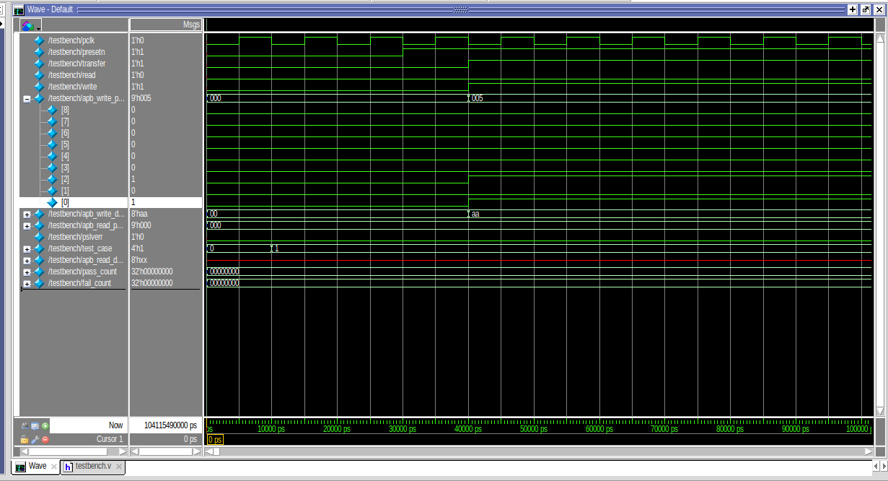
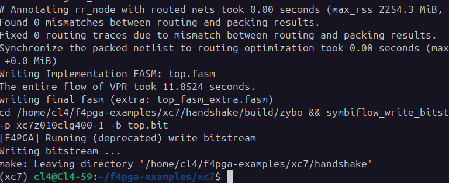

# On-Chip Bus & Handshaking Protocol Design, Simulation, and FPGA Implementation


-red.svg)


---

## 📌 Table of Contents
1. [Project Overview](#-project-overview)
2. [Repository Structure](#-repository-structure)
3. [Task 1: AMBA APB (Advanced Peripheral Bus) Design & Verification](#-task-1-amba-apb-advanced-peripheral-bus-design--verification)
   - [Protocol Overview & Architecture](#protocol-overview--architecture)
   - [Master & Slave FSM Implementation](#master--slave-fsm-implementation)
   - [Comprehensive Testbench & 10 Test Cases](#comprehensive-testbench--10-test-cases)
   - [Simulation Results & Waveform Analysis](#simulation-results--waveform-analysis)
4. [Task 2: Valid-Ready Handshaking Protocol & FPGA Implementation](#-task-2-valid-ready-handshaking-protocol--fpga-implementation)
   - [Protocol Mechanics & State Machines](#protocol-mechanics--state-machines)
   - [Zybo Z7 Pin Mapping & Constraints](#zybo-z7-pin-mapping--constraints)
   - [F4PGA / SymbiFlow Open-Source Build Flow](#f4pga--symbiflow-open-source-build-flow)
   - [Hardware Demonstration](#hardware-demonstration)
5. [Task 3: Gate-Level Schematic & Logisim Circuit Design](#-task-3-gate-level-schematic--logisim-circuit-design)
   - [Master-Slave Top-Level Circuit](#master-slave-top-level-circuit)
   - [Master FSM Sub-Circuit](#master-fsm-sub-circuit)
   - [Slave FSM Sub-Circuit](#slave-fsm-sub-circuit)
   - [Slave Datapath & Memory Circuit](#slave-datapath--memory-circuit)
6. [How to Run & Verify](#-how-to-run--verify)

---

## 📖 Project Overview

This repository documents the complete design, verification, gate-level schematic modeling, and FPGA hardware deployment of two essential digital communication protocols:
1. **AMBA 3 APB (Advanced Peripheral Bus)**: A standard low-power, low-overhead on-chip peripheral bus protocol featuring multi-slave addressing, wait-state injection (`PREADY`), and bus error handling (`PSLVERR`).
2. **Valid-Ready Handshaking Protocol**: A robust 2-way asynchronous/synchronous flow-control handshake implemented in RTL Verilog, mapped and synthesized to a **Digilent Zybo Z7 (Xilinx Zynq-7000 XC7Z010)** FPGA using the open-source **F4PGA** toolchain, and modeled at the gate/schematic level in **Logisim**.

---

## 📂 Repository Structure

```
APB/
├── README.md                      # Comprehensive Project Documentation
├── HSGLab1.docx                   # Lab specification & experiment report
├── Pics/                          # Visual proof, waveforms, schematics & board photos
│   ├── Screenshot 2026-08-23 230606.png   # Master-Slave Handshake Logisim Schematic
│   ├── Screenshot 2026-08-23 230623.png   # Master FSM Circuit Schematic
│   ├── Screenshot 2026-08-23 230627.png   # Slave FSM Circuit Schematic
│   ├── Screenshot 2026-08-23 230641.png   # Slave Memory & Datapath Schematic
│   ├── Screenshot 2026-08-23 230650.png   # Digilent Zybo Z7 FPGA Board Deployment
│   ├── apb_waveform_simulation.png        # ModelSim APB Protocol Simulation Waveform
│   └── f4pga_build_terminal.png           # F4PGA / SymbiFlow Bitstream Build Log
├── Src/
│   ├── apb/                       # Task 1: AMBA APB Bus Protocol RTL & Testbench
│   │   ├── master.v               # APB Master Module (FSM, Control & Address Decoder)
│   │   ├── slave.v                # APB Slave Memory Module (256 x 8-bit RAM)
│   │   ├── top.v                  # Top Interconnect (1 Master driving 2 Slaves)
│   │   └── testbench.v            # 10-TestCase Comprehensive Verification Suite
│   └── handshake/                 # Task 2: Handshake Protocol & FPGA Implementation
│       ├── master.v               # Handshake Master Controller FSM
│       ├── slave.v                # Handshake Slave Controller & Memory FSM
│       ├── top.v                  # Top-level FPGA Wrapper Module
│       ├── zybo.xdc               # Physical Constraint File for Zybo Z7
│       ├── Makefile               # F4PGA Automated Build Script
│       └── flow.json              # SymbiFlow Synthesis / PnR Flow Config
└── circs/
    └── WorkingSlaveOFHSG.circ     # Task 3: Complete Logisim Circuit Model (.circ)
```

---

## 🚀 Task 1: AMBA APB (Advanced Peripheral Bus) Design & Verification

### Protocol Overview & Architecture
The **Advanced Peripheral Bus (APB)** is part of the ARM AMBA protocol family, optimized for minimal power consumption and reduced interface complexity to connect memory-mapped peripherals.

```
       +--------------------------------------------------------+
       |                       APB TOP                          |
       |                                                        |
       |  +--------------+         APB BUS (PADDR, PWDATA, ...) |
       |  |              |==================================+   |
       |  |  APB Master  |                                  |   |
       |  |   (master.v) |----+ PSEL1       + PSEL2         |   |
       |  +--------------+    |             |               |   |
       |         ^            v             v               |   |
       |         |       +----------+  +----------+         |   |
       |         |       | APB      |  | APB      |         |   |
       |         |       | Slave 1  |  | Slave 2  |         |   |
       |         |       | (0x000-  |  | (0x100-  |         |   |
       |         |       |  0x0FF)  |  |  0x1FF)  |         |   |
       |         |       +----------+  +----------+         |   |
       |         |             |             |              |   |
       |         +-------------+-------------+              |
       |                PREADY / PRDATA / PSLVERR           |
       +--------------------------------------------------------+
```

### Master & Slave FSM Implementation

#### 1. APB Master (`Src/apb/master.v`)
The APB Master is implemented as a 3-state Finite State Machine:
- **`IDLE` (`2'b00`)**: Default state. `PSEL` and `PENABLE` are deasserted (`0`). When `transfer == 1`, transitions to `SETUP`.
- **`SETUP` (`2'b01`)**: Asserts the appropriate slave select line (`PSEL1` if `PADDR[8] == 0`, `PSEL2` if `PADDR[8] == 1`), drives address `PADDR`, write signal `PWRITE`, and write data `PWDATA`. Transitions unconditionally to `ENABLE` on the next clock cycle.
- **`ENABLE` (`2'b10`)**: Asserts `PENABLE = 1`. Maintains signals stable until the slave returns `PREADY = 1`. If `PREADY == 1`, the transfer completes: captures `PRDATA` on reads, and transitions to `SETUP` if another `transfer` is queued, or returns to `IDLE`.

#### 2. APB Slave (`Src/apb/slave.v`)
- Implements a **256-byte internal memory array** (`reg [7:0] memory [255:0]`).
- Synchronously checks `PSEL` and `PENABLE`:
  - **Write Transfer (`PWRITE = 1`)**: Writes `PWDATA` to `memory[PADDR]`, asserts `PREADY = 1`.
  - **Read Transfer (`PWRITE = 0`)**: Drives `PRDATA <= memory[PADDR]`, asserts `PREADY = 1`.
  - **Error Generation**: Asserts `PSLVERR = 1` if an out-of-range memory access occurs.

---

### Comprehensive Testbench & 10 Test Cases (`Src/apb/testbench.v`)

The testbench systematically validates all functional requirements and edge cases of the APB standard through 10 distinct test tasks:

| Test Case | Description | Verification Objective | Pass Criteria |
| :--- | :--- | :--- | :--- |
| **TC1** | **Basic Write Operation** | Master writes `8'hAA` to address `9'h005`. | `slave1_inst.memory[0x05] === 8'hAA` |
| **TC2** | **Basic Read Operation** | Master reads from address `9'h005`. | Returned read data equals `8'hAA` |
| **TC3** | **Address Decoding / Slave Selection** | Tests address MSB decoding: `0x005` (Slave 1) vs `0x085`/`0x100`+ (Slave 2). | `PSEL1=1, PSEL2=0` for Slave 1; `PSEL1=0, PSEL2=1` for Slave 2 |
| **TC4** | **Write Transfer with Wait States** | Forces `PREADY = 0` for 3 clock cycles during write. | Master holds in `ENABLE` state until `PREADY` is released, data correctly written. |
| **TC5** | **Read Transfer with Wait States** | Forces `PREADY = 0` for 3 clock cycles during read. | Master maintains transfer, correctly captures read data upon `PREADY` assertion. |
| **TC6** | **Error Handling (`PSLVERR`)** | Accesses invalid address `9'h1FF`. | Slave / Top-level correctly asserts `PSLVERR = 1`. |
| **TC7** | **Burst / Back-to-Back Transfers** | Executes consecutive back-to-back writes (`0x11, 0x22, 0x33`) followed by reads without IDLE cycles. | All three locations updated and read back with zero protocol corruption. |
| **TC8** | **Out-of-Range Address Handling** | Accesses address outside valid memory mapping. | Error response validated. |
| **TC9** | **Reset Behavior (`PRESETn`)** | Asserts active-low asynchronous reset during operation. | Master immediately resets to `IDLE`, deasserts `PSEL1`, `PSEL2`, `PENABLE`. |
| **TC10** | **Randomized Stress Testing** | Executes 20 randomized read and write transactions with random addresses and data. | 100% transaction completion without bus hanging or deadlocks. |

---

### Simulation Results & Waveform Analysis



*Figure 1: ModelSim waveform timing diagram showing clock `pclk`, active-low reset `presetn`, control inputs (`transfer`, `read`, `write`), address and data buses (`apb_write_paddr`, `apb_write_data`), error signaling (`pslverr`), and test progress indicators (`test_case`, `pass_count`).*

**Key Observations from Simulation**:
1. During `SETUP` phase, address `9'h005` and write data `8'hAA` are set up.
2. In the `ENABLE` phase, `PENABLE` is asserted and the slave acknowledges the transaction.
3. The test bench logs confirmed **`ALL TEST CASES PASSED`** with `pass_count = 10` and `fail_count = 0`.

---

## ⚡ Task 2: Valid-Ready Handshaking Protocol & FPGA Implementation

### Protocol Mechanics & State Machines

The Valid-Ready Handshaking protocol guarantees reliable, lossless data transfer between two independent clock domains or asynchronous interfaces through two control flags:
- **`valid` (driven by Master)**: Indicates that the master has placed valid data and address on the bus.
- **`ready` (driven by Slave)**: Indicates that the slave has accepted the data or completed the requested access.

#### Master FSM (`Src/handshake/master.v`)
| State | Encoding | `valid` | Action |
| :--- | :---: | :---: | :--- |
| **`IDLE`** | `2'b00` | `0` | Waits for `start == 1`. Bus outputs remain idle. |
| **`SEND`** | `2'b01` | `1` | Drives `addr`, `rw`, `datain` onto the bus and asserts `valid = 1`. Transitions to `WAIT`. |
| **`WAIT`** | `2'b10` | `1` | Holds control signals stable until `ready == 1` is received from the slave. |

#### Slave FSM (`Src/handshake/slave.v`)
| State | Encoding | `ready` | Action |
| :--- | :---: | :---: | :--- |
| **`IDLE`** | `2'b00` | `0` | Waits for master to assert `valid == 1`. |
| **`ACCESS`** | `2'b01` | `0` | Executes memory write (`if rw == 1: mem[addr] <= datain`) or read (`if rw == 0: dataout <= mem[addr]`). |
| **`DONE`** | `2'b10` | `1` | Asserts `ready = 1` to signal handshake completion to the master. |

---

### Zybo Z7 Pin Mapping & Constraints (`Src/handshake/zybo.xdc`)

The design was constrained to the physical I/O pins of the **Digilent Zybo Z7 (XC7Z010-1CLG400C)**:

```tcl
## Switches
set_property -dict { PACKAGE_PIN G15 IOSTANDARD LVCMOS33 } [get_ports { clk }]
set_property -dict { PACKAGE_PIN P15 IOSTANDARD LVCMOS33 } [get_ports { rst }]
set_property -dict { PACKAGE_PIN W13 IOSTANDARD LVCMOS33 } [get_ports { start }]
set_property -dict { PACKAGE_PIN T16 IOSTANDARD LVCMOS33 } [get_ports { rw }]

## Push Buttons / Output Data
set_property -dict { PACKAGE_PIN K18 IOSTANDARD LVCMOS33 } [get_ports { dataFpga[0] }]
set_property -dict { PACKAGE_PIN P16 IOSTANDARD LVCMOS33 } [get_ports { dataFpga[1] }]
set_property -dict { PACKAGE_PIN K19 IOSTANDARD LVCMOS33 } [get_ports { dataFpga[2] }]
set_property -dict { PACKAGE_PIN Y16 IOSTANDARD LVCMOS33 } [get_ports { dataFpga[3] }]

## Status LEDs
set_property -dict { PACKAGE_PIN V16 IOSTANDARD LVCMOS33 } [get_ports { valid }]
set_property -dict { PACKAGE_PIN F17 IOSTANDARD LVCMOS33 } [get_ports { ready }]
```

---

### F4PGA / SymbiFlow Open-Source Build Flow

The design was compiled using the open-source **F4PGA (SymbiFlow)** toolchain for Xilinx 7-Series FPGAs.



*Figure 2: Terminal build log demonstrating automated netlist synthesis, packing, VPR placement & routing (11.85 seconds, 0 mismatches), and final bitstream generation (`symbiflow_write_bitstream -p xc7z010clg400-1 -b top.bit`).*

---

### Hardware Demonstration


*Figure 3: Physical verification on the Digilent Zybo Z7 board. On-board slide switches configure `clk`, `rst`, `start`, and `rw`, while LED indicators confirm the active `valid` and `ready` handshake phases and lower data nibble outputs.*

---

## 🎨 Task 3: Gate-Level Schematic & Logisim Circuit Design

The complete handshaking protocol was implemented and verified at the schematic gate-level using **Logisim** (`circs/WorkingSlaveOFHSG.circ`).

### 1. Master-Slave Top-Level Circuit


*Figure 4: Logisim Top-Level Circuit interconnecting the Master FSM block, Slave sub-circuit, clock, clear/reset line, address lines `addr[1:0]`, data bus `dataIn[7:0]`, `w` (read/write), and handshake status lines (`masterReady`, `slave`).*

---

### 2. Master FSM Sub-Circuit


*Figure 5: Gate-level realization of the Master FSM using D Flip-Flops and logic gates (AND, OR, NOT) to generate the state transitions (`IDLE -> SEND -> WAIT -> IDLE`) and drive the output `valid` signal.*

---

### 3. Slave FSM Sub-Circuit


*Figure 6: Gate-level realization of the Slave FSM capturing the input `valid` signal, sequencing through state flip-flops (`q0`, `q1`), and asserting the `ready` output flag upon transaction completion.*

---

### 4. Slave Datapath & Memory Circuit


*Figure 7: Slave internal datapath architecture featuring a 2-to-4 address decoder (`Decd`), 4 parallel 8-bit registers representing addressable memory locations, write-enable AND gating, and an output 4-to-1 Multiplexer (`MUX`) driving `dataOut`.*

---

## 🛠️ How to Run & Verify

### 1. Simulating APB Protocol in ModelSim / QuestaSim
```bash
# Navigate to APB directory
cd Src/apb

# Compile Verilog sources
vlog master.v slave.v top.v testbench.v

# Launch console simulation
vsim -c testbench -do "run -all; quit"

# Alternatively, view waveform in ModelSim GUI
vsim testbench
# Add signals and run
add wave -r /*
run -all
```

### 2. Synthesizing for Zybo Z7 using F4PGA
```bash
# Navigate to Handshake directory
cd Src/handshake

# Run automated synthesis and bitstream generation via Makefile
make clean
make

# Program bitstream to FPGA
openFPGALoader -b zybo_z7 top.bit
```

### 3. Running Logisim Circuit Simulation
1. Launch **Logisim** (or Logisim-Evolution).
2. Open [`circs/WorkingSlaveOFHSG.circ`](circs/WorkingSlaveOFHSG.circ).
3. Enable Ticks (`Simulate -> Ticks Enabled` / `Ctrl+K`).
4. Toggle inputs (`start`, `addr`, `w`, `dataIn`) using the Poke Tool to observe the step-by-step handshake and register storage in real time.

---

## 👥 Contributors & Acknowledgements
- **Author**: HSG
- **Platform**: Digilent Zybo Z7 (Xilinx Zynq XC7Z010)
- **Tools**: ModelSim, Logisim, F4PGA / SymbiFlow, Yosys, VPR
