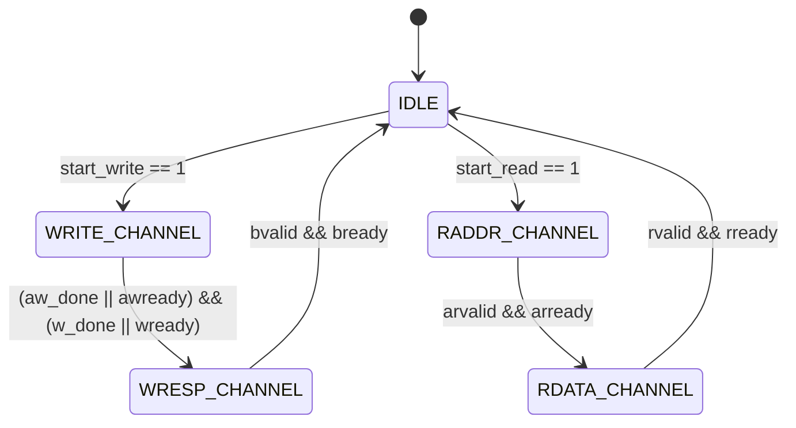

# AXI4-Lite Master-Slave Bus Interface in Verilog

[](https://en.wikipedia.org/wiki/Verilog)
[](https://developer.arm.com/documentation/ihi0022/e)
[](http://iverilog.icarus.com/)

A modular and synthesizable implementation of the **AXI4-Lite (Advanced eXtensible Interface 4 Lite)** protocol in Verilog. This repository contains complete RTL implementations for an **AXI4-Lite Master**, an **AXI4-Lite Slave Memory Peripheral**, a top-level integration wrapper, and a self-checking testbench with GTKWave simulation waveforms.

---

## 📑 Table of Contents

- [Overview](#-overview)
- [Key Features](#-key-features)
- [Repository Structure](#-repository-structure)
- [AXI4-Lite Protocol & Channels](#-axi4-lite-protocol--channels)
- [Architecture & Design Details](#-architecture--design-details)
  - [1. AXI Master (`axi_master.v`)](#1-axi-master-axi_masterv)
  - [2. AXI Slave (`axi_slave.v`)](#2-axi-slave-axi_slavev)
  - [3. Top-Level Integration (`axi_top.v`)](#3-top-level-integration-axi_topv)
- [Simulation Waveforms & Verification](#-simulation-waveforms--verification)
  - [Master Waveform Simulation](#master-waveform-simulation)
  - [Slave Waveform Simulation](#slave-waveform-simulation)
- [How to Run and Simulate](#-how-to-run-and-simulate)
- [Verification Results](#-verification-results)
- [License](#-license)

---

## 📖 Overview

The **AXI4-Lite** protocol is a streamlined, low-complexity subset of the AMBA AXI4 specification tailored for memory-mapped register access and communication between control processors and hardware peripherals. 

This project demonstrates:
- A parameterizable FSM-driven **AXI Master** supporting concurrent address/data handshakes.
- An **AXI Slave** featuring an internal 16x32-bit register file / memory array with word-aligned addressing (`address[5:2]`).
- Full support for all 5 independent AXI channels with ready/valid handshakes (`VALID` before `READY` / `READY` before `VALID` compliant).

---

## ✨ Key Features

- **Standard Compliance**: Conforms to standard AXI4-Lite handshake rules (`AWVALID`/`AWREADY`, `WVALID`/`WREADY`, `BVALID`/`BREADY`, `ARVALID`/`ARREADY`, `RVALID`/`RREADY`).
- **Independent Handshake Tracking**: The Master module uses internal tracking flags (`aw_done`, `w_done`) to handle out-of-order/independent address and data channel completions during write transactions.
- **Synchronous Design with Active-Low Reset**: Fully synchronous to `aclck` with asynchronous active-low reset `aresetn`.
- **Word-Aligned Addressing**: Slave implements 32-bit word alignment mapping `address[5:2]` to 16 addressable memory registers (addresses `0x00` to `0x3C`).
- **Self-Checking Testbench**: Validates write and read operations with automated pass/fail verification.

---

## 📁 Repository Structure

```tree
AXI-lite/
├── pics/
│   ├── Screenshot 2026-08-23 231444.png   # Slave GTKWave waveform capture
│   └── Screenshot 2026-08-23 231451.png   # Master GTKWave waveform capture
├── src/
│   ├── axi_master.v                       # AXI4-Lite Master FSM & channel controller
│   ├── axi_slave.v                        # AXI4-Lite Slave with internal 16x32-bit RAM
│   ├── axi_top.v                          # Top-level interconnect wrapper
│   └── axi_tb.v                           # Self-checking testbench
└── README.md                              # Project documentation
```

---

## 🔄 AXI4-Lite Protocol & Channels

The interface consists of **5 independent transaction channels**:

| Channel | Signal | Direction (M $\to$ S) | Description |
| :--- | :--- | :---: | :--- |
| **Write Address (AW)** | `AW[31:0]` | Master $\to$ Slave | Write address bus |
| | `awvalid` | Master $\to$ Slave | Write address valid signal |
| | `awready` | Slave $\to$ Master | Write address acknowledge/ready |
| **Write Data (W)** | `W[31:0]` | Master $\to$ Slave | Write data payload |
| | `wvalid` | Master $\to$ Slave | Write data valid signal |
| | `wready` | Slave $\to$ Master | Write data acknowledge/ready |
| **Write Response (B)** | `bvalid` | Slave $\to$ Master | Write response valid signal |
| | `bready` | Master $\to$ Slave | Master ready to accept write response |
| **Read Address (AR)** | `AR[31:0]` | Master $\to$ Slave | Read address bus |
| | `arvalid` | Master $\to$ Slave | Read address valid signal |
| | `arready` | Slave $\to$ Master | Read address acknowledge/ready |
| **Read Data (R)** | `R_data[31:0]` / `R` | Slave $\to$ Master | Read data payload |
| | `rvalid` | Slave $\to$ Master | Read data valid signal |
| | `rready` | Master $\to$ Slave | Master ready to accept read data |

---

## 🏗 Architecture & Design Details

### 1. AXI Master (`axi_master.v`)

The master is implemented as a 5-state Finite State Machine (FSM):



#### FSM State Descriptions:
1. **`IDLE` (`3'd0`)**: Waits for control commands `start_write` or `start_read`. Latch address and write data.
2. **`WRITE_CHANNEL` (`3'd3`)**: Asserts `awvalid` and `wvalid`. Tracks independent completions (`aw_done`, `w_done`). Once both are completed, transitions to `WRESP_CHANNEL`.
3. **`WRESP_CHANNEL` (`3'd4`)**: Asserts `bready = 1'b1`. Waits for `bvalid` from the slave, then returns to `IDLE`.
4. **`RADDR_CHANNEL` (`3'd1`)**: Asserts `arvalid = 1'b1` with the requested read address `AR`. Transitions to `RDATA_CHANNEL` when `arready` is acknowledged.
5. **`RDATA_CHANNEL` (`3'd2`)**: Asserts `rready = 1'b1`. Latches incoming `R_data` into output register `R` upon `rvalid` assertion and returns to `IDLE`.

---

### 2. AXI Slave (`axi_slave.v`)

The slave models a 16-entry 32-bit register/memory file (`memory[0:15]`):
- **Write Processing**:
  1. `awready` and `wready` are asserted when ready to receive a new transaction.
  2. Latches address index `aw_index = AW[5:2]` on `awvalid && awready`.
  3. Latches data payload `w_buffer = W` on `wvalid && wready`.
  4. Once both components are received (`aw_received && w_received`), commits data to `memory[aw_index]` and asserts `bvalid = 1'b1`.
  5. Clears `bvalid` once acknowledged with `bready`.
- **Read Processing**:
  1. Receives read address `AR` on `arvalid && arready`.
  2. Fetches `R_data = memory[AR[5:2]]` and asserts `rvalid = 1'b1`.
  3. Clears `rvalid` once master acknowledges with `rready`.

---

### 3. Top-Level Integration (`axi_top.v`)

Connects the `axi_master` and `axi_slave` point-to-point via internal channel wires and exposes a high-level user interface:

```verilog
module axi_top (
    input  wire        aclck,
    input  wire        aresetn,
    input  wire        start_read,
    input  wire        start_write,
    input  wire [31:0] address,
    input  wire [31:0] W_data,
    output wire [31:0] R
);
```

---

## 📊 Simulation Waveforms & Verification

The design was verified using **Icarus Verilog** and inspected using **GTKWave**.

### Master Waveform Simulation
The master waveform below demonstrates:
1. **Write Transaction** at `t = 20ns`: `start_write` pulses high, entering state `3` (`WRITE_CHANNEL`). `AW` address `0x00000000` and `W` data `0x5A5AA5A5` are transmitted. Upon receiving slave ready signals, it advances to state `4` (`WRESP_CHANNEL`) and waits for `bvalid`.
2. **Read Transaction** at `t = 90ns`: `start_read` pulses high, entering state `1` (`RADDR_CHANNEL`). Upon `arready`, it moves to state `2` (`RDATA_CHANNEL`) and successfully captures `R = 0x5A5AA5A5`.


---

### Slave Waveform Simulation
The slave waveform below illustrates internal memory indexing and buffer operations:
1. **Write Operation**: Captures `aw_index = 0` and `w_buffer = 0x5A5AA5A5`, commits to `memory[0]`, and asserts `bvalid`.
2. **Read Operation**: Receives read address `AR`, looks up `memory[AR[5:2]]`, outputs `R_data = 0x5A5AA5A5`, and raises `rvalid`.


---

## 🚀 How to Run and Simulate

### Prerequisites
- [Icarus Verilog (`iverilog`)](http://iverilog.icarus.com/)
- [GTKWave](http://gtkwave.sourceforge.net/)

### Steps

1. **Clone the repository**:
   ```bash
   git clone https://github.com/your-username/AXI-lite.git
   cd AXI-lite
   ```

2. **Compile the Verilog source files**:
   ```bash
   iverilog -o axi_sim.vvp src/axi_master.v src/axi_slave.v src/axi_top.v src/axi_tb.v
   ```

3. **Execute the simulation**:
   ```bash
   vvp axi_sim.vvp
   ```

4. **View Waveforms in GTKWave**:
   *(If VCD dumping is enabled in testbench)*
   ```bash
   gtkwave axi_tb.vcd
   ```

---

## ✅ Verification Results

The self-checking testbench verifies full loopback write-read integrity:

```text
VCD info: dumpfile axi_tb.vcd opened for output.
TEST PASSED: R = 5a5aa5a5
```

---

## 📄 License

This project is licensed under the MIT License - see the [LICENSE](LICENSE) file for details.
