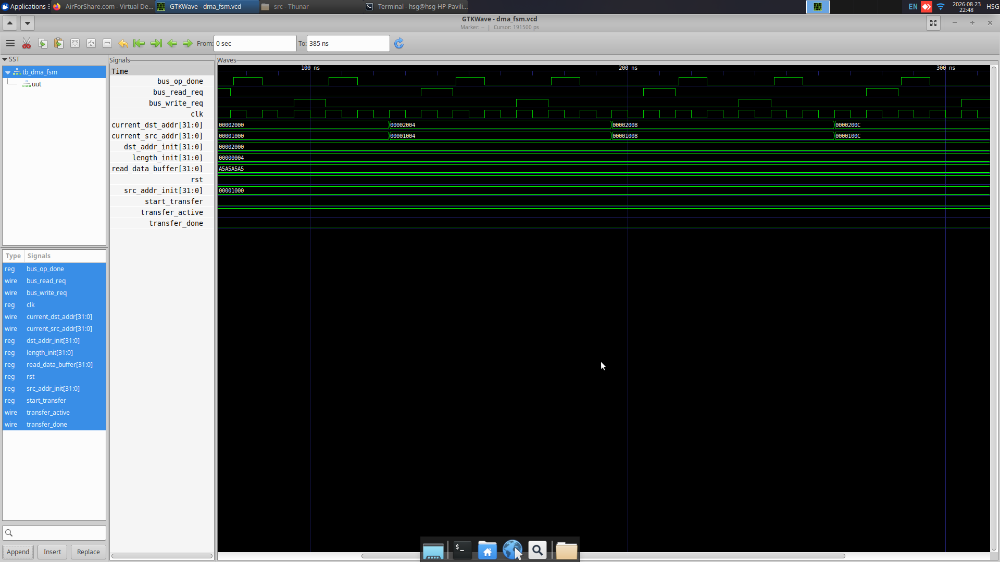
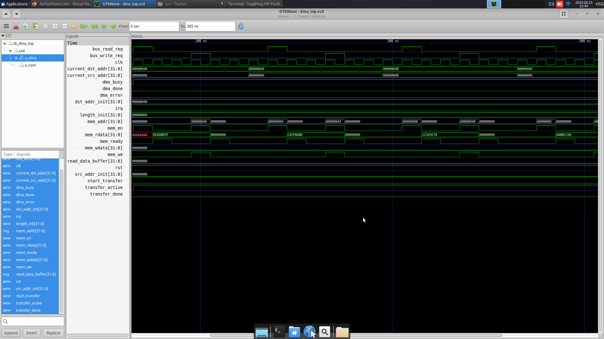

# DMA Controller Design (Lab 4)

## Project Structure

```
DMA/
├── pics/
│   ├── task1.png
│   └── task2.png
├── src/
│   ├── dma_fsm.v
│   ├── tb_dma_fsm.v
│   ├── ram.v
│   ├── dma_engine.v
│   ├── dma_top.v
│   └── tb_dma_top.v
└── README.md
```

---

## Task 1: DMA FSM

Finite State Machine implementing the DMA transfer states:
- `STATE_IDLE`
- `STATE_READ`
- `STATE_WAIT_READ`
- `STATE_WRITE`
- `STATE_WAIT_WRITE`
- `STATE_INC_ADDR`
- `STATE_DONE`

### Run Simulation & GTKWave

```bash
iverilog -o sim_task1.vvp src/dma_fsm.v src/tb_dma_fsm.v
vvp sim_task1.vvp
gtkwave dma_fsm.vcd
```

### Waveform



---

## Task 2: Complete DMA Engine with Memory

Top-level DMA system integrating:
- `dma_fsm`: Control state machine
- `dma_engine`: Registers, internal buffer, and bus control
- `ram`: Synchronous memory module

### Run Simulation & GTKWave

```bash
iverilog -o sim_task2.vvp src/ram.v src/dma_fsm.v src/dma_engine.v src/dma_top.v src/tb_dma_top.v
vvp sim_task2.vvp
gtkwave dma_top.vcd
```

### Waveform


